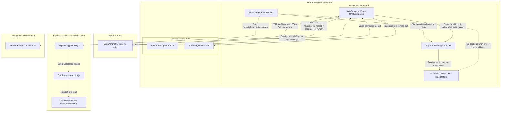

# System Architecture Diagram

This document illustrates the software architecture, integrations, and data flows of the **Flight-Call-Bot** application, reflecting the actual state of the codebase.

---

### Component & Data Flow Architecture

The following diagram depicts the operational structure of the system, illustrating how voice, text, external APIs, and local fallback stores interact:

---

### Key Architectural Layers

#### 1. Frontend Client Layer (Active React SPA)
* **Views & Controls:** Handles UI presentation (`LoginScreen`, `LookupScreen`, `DisruptedScreen`, `RebookScreen`, `RefundScreen`, `ConfirmationScreen`, `DashboardScreen`, `NewBookingScreen`).
* **State Manager (`App.tsx`):** Coordinates application transitions, stores active user profiles and bookings, and maintains the current recovery pathway.
* **Mock Data Store (`mockData.ts`):** Serves as the database substitute. Contains full details for all passenger accounts, original bookings, and alternative routes.

#### 2. Natural Voice & Conversational Engine (Client-Side)
* **Stateful Chat Widget (`ChatWidget.tsx`):** The float control triggering the recovery chat overlay. Holds current session message queues and conversation histories.
* **Web Speech API Integrations:** 
  * **Speech-to-Text (STT):** Uses native `SpeechRecognition` configured for `hi-IN` to capture Hindi/English verbal inputs, converting them to text.
  * **Text-to-Speech (TTS):** Uses native `SpeechSynthesis` and `SpeechSynthesisUtterance` to read response strings aloud.
* **OpenAI completions (`gpt-4o-mini`):** Interacts via client-side OpenAI completions. Uses a system prompt and custom tool callbacks (`navigate_to_rebook`, `navigate_to_refund`, `rebook_flight`, `search_flights`, `book_new_flight`, `escalate_to_human`) to trigger client actions.

#### 3. Backend REST & Decision Layer (Inactive/Unimplemented)
* **Express Server (`backend/src/server.js`):** Intended server wrapper. Inactive due to missing files.
* **Bot Router (`backend/src/routes/bot.js`):** Exposes classification, response generation, and agent escalation HTTP routes.
* **Escalation Rules Engine (`backend/src/services/escalationRules.js`):** Houses the code to process keyword patterns and scenario tags for human agent routing.

#### 4. Deployment Layer
* **Render blueprints (`render.yaml`):** Provisions a Render Static Site builder. Runs `npm install && npm run build` to compile the React client, publishing static folders under `./dist` to Render edge networks.
