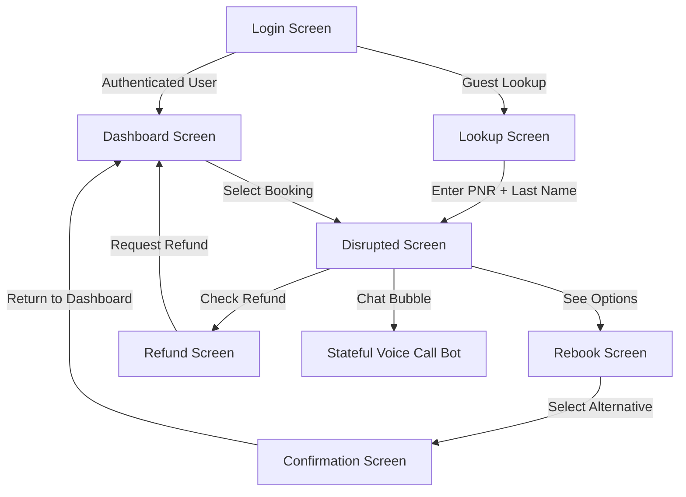
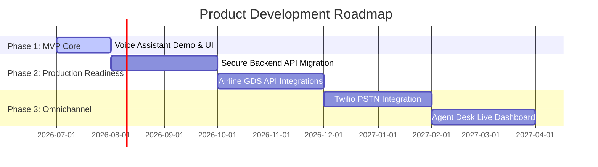

# Solution Design Document
## Flight-Call-Bot: Self-Service Flight Recovery
**Team Name:** Hack Hustlers  
**College:** Sardar Vallabhbhai Patel Institute of Technology, Vasad  
**Team Members:** Jaydev Prajapati, Shivansh Darji  
**Challenge:** 22North Product Engineering Challenge 2026 — Challenge 1: Self-Service Flight Recovery  
**Customer:** SkyJet Airways (65 aircraft across Asia)  
**Live Demo:** [flight-call-bot.onrender.com](https://flight-call-bot.onrender.com/)  
**GitHub Repository:** [github.com/Shivanshdarji/Flight-Call-Bot](https://github.com/Shivanshdarji/Flight-Call-Bot)  

---

### 1. Business Understanding

SkyJet Airways, a regional carrier operating 65 aircraft across Asia, suffers significant operational and financial strain during flight disruptions. When flights are delayed or cancelled, **40% of affected passengers** call the support center, leading to average wait times of **25 minutes** and high customer dissatisfaction. 

`Flight-Call-Bot` solves this bottleneck by providing an automated, voice-enabled, self-service flight recovery channel. By automating the routine **60-70%** of disruption queries—specifically straightforward rebooking and refund options based on policy rules—it offloads massive call volume from the contact center. For safety-sensitive, highly complex (multi-leg, multi-airline), or emotionally charged situations, the system automatically detects keywords and escalates the ticket to a human agent with a full call transcript, optimizing resource allocation.

---

### 2. Customer Journey

The application implements a multi-view Single Page Application (SPA) flow that guides passengers from disruption discovery to resolution:

#### Implemented Views & Flows
1. **Login Screen (`LoginScreen.tsx`):** Users can authenticate using pre-seeded accounts (e.g., Alex Smith, Jane Doe). This accesses the user profile and displays all active bookings on their account.
2. **Lookup Screen (`LookupScreen.tsx`):** Allows guests without accounts to look up their booking using a Passenger Name Record (PNR) and Last Name. To speed up hackathon judging, 10 **Demo Scenario Pills** are included at the bottom to prefill specific edge cases (e.g., ATC restrictions, crew scheduling, security events).
3. **Dashboard Screen (`DashboardScreen.tsx`):** Acts as the post-login hub. It lists the user's flight bookings. For cancelled segments, it triggers a high-visibility disruption warning alert and navigates to the recovery workflow.
4. **Disrupted Screen (`DisruptedScreen.tsx`):** Serves as the primary status page for disrupted bookings. It displays the cancellation reason (e.g., severe weather, technical fault) and guides the user toward either "Rebooking Options" or "Refund & Voucher Eligibility".
5. **Rebook Screen (`RebookScreen.tsx`):** Displays a checklist of 3 alternative flight options (flight times, dates, durations, stops, and seat availability). If the backend API is unreachable, it gracefully falls back to predefined routes.
6. **Refund Screen (`RefundScreen.tsx`):** Calculates and details the passenger's refund eligibility based on the disruption reason. It displays the refund amount and shows whether a meal/hotel voucher is issued. Clicking "Request Refund" processes a simulated transaction.
7. **Confirmation Screen (`ConfirmationScreen.tsx`):** Confirms that a protected seat on an alternative flight has been secured, showing the updated flight code and departure details.
8. **Stateful Voice Call Bot (`ChatWidget.tsx`):** Accessible via a floating widget on all screens. It uses the Web Speech API to provide interactive Hindi/English voice dialogs and performs client-side actions dynamically.

---

### 3. Design Decisions

#### Why Voice and Conversational UI?
During travel disruptions, passengers are often in transit (carrying luggage, walking through terminals, or in loud environments) where typing on a mobile screen is inconvenient. A conversational voice interface mirrors the familiar experience of calling a support number, but without the hold times. Setting speech recognition to `hi-IN` supports natural multilingual interactions (English, Hindi, and Hinglish).

#### Technology Stack
- **Frontend Core:** React 19, Vite, TypeScript, Tailwind CSS, Lucide icons, and Motion (Framer Motion) for smooth micro-animations.
- **AI Processing:** OpenAI SDK (`gpt-4o-mini`) integrated directly into the client-side chat interface. Using OpenAI's tool calling allows the LLM to trigger navigation, execute rebookings, and request escalations.
- **Voice Services:** Browser native **Web Speech API** (`SpeechRecognition` and `SpeechSynthesis`) to deliver speech-to-text and text-to-speech without incurring the latency or cost of server-side voice pipelines.
- **Backend Core (Planned Architecture):** Node.js and Express backend designed to handle route classifications, database queries, and escalation tracking.

#### Key Architectural Choices
- **Client-Side Function Calling:** The LLM receives the active booking context and is equipped with functional tools:
  - `navigate_to_rebook` & `navigate_to_refund`: Syncs the visual UI state with the conversation.
  - `rebook_flight` & `book_new_flight`: Directly updates client-side React states.
  - `search_flights`: Queries available alternatives.
  - `escalate_to_human`: Triggers a handoff event.
- **Structured Escalation Rules:** A rule-based engine escalates when:
  - High-priority keywords are detected (`medical`, `wheelchair`, `sue`, `connecting flight`).
  - Disruption category involves security or complex connection logic.
  - Classification confidence falls below a 50% threshold twice in a single session.

---

### 4. Assumptions & Mocking

Due to the 48-hour development window of the hackathon, several aspects are simulated or mocked:
- **Client-Side Autonomy:** While a Node.js/Express backend service is partially structured, the React frontend runs as a fully standalone client. All lookup operations, alternative flight choices, and state changes operate on client-side state models initialized from `src/mockData.ts`.
- **OpenAI Key Storage:** The application uses `import.meta.env.VITE_OPENAI_API_KEY` for OpenAI completions. In a production system, this key must reside securely on a backend server.
- **Simulated Payment and Ticketing:** Refund processing is simulated, updating the booking's `refundStatus` state to `Refunded` without linking to a payment gateway. Rebooking updates the booking's flight object directly without hitting an airline inventory database.
- **Handoff Simulation:** Escalation triggers transition the chat panel into an "Escalated to Agent" mode with a simulated queue wait-time ticker (queue position, estimated wait minutes, and callback option).

---

### 5. Architectural Trade-offs

| Planned Component | Implemented Approach | Justification for MVP |
|---|---|---|
| **Server-Side API Routing** | In-Browser Client Fetch + Mock fallbacks | Avoided server deployment complexity and local database connection errors on Windows hosts during fast prototyping. |
| **Real PSTN Telephony** | Web-based Web Speech API | Twilio Voice and SIP trunks require long setup times and are notoriously unstable for short hackathon live demonstrations. Web-based speech shows the voice concept instantly. |
| **Rule Engine DB** | Hardcoded logic in React & Node files | Implementing a dynamic rule engine or database-driven rules (e.g., using a business rules management system) is too heavy for a 48-hour proof of concept. |
| **Natural Language Escalation** | Keyword-based Regex matching | Highly deterministic, runs instantly on the client, and ensures that sensitive words (e.g. `sue`, `wheelchair`) guarantee immediate escalation. |

---

### 6. Scalability & Security Notes

To transition this MVP into a production-ready application, the architecture must evolve:
1. **API Security & Key Protection:** Migrate all OpenAI completions and tool executions to a secure backend. The client should never access the OpenAI API key directly.
2. **Authentication & Session Management:** Replace the basic mock profiles with robust OAuth2/OIDC authentication (e.g., Auth0, Firebase Auth) to verify passenger identities before returning flight details.
3. **Database Integration:** Move from in-memory arrays to a relational database (e.g., PostgreSQL) or caching layer (e.g., Redis) to track session states and escalation ticket logs.
4. **Twilio Voice & PSTN Integration:** Integrate the voice assistant with Twilio Media Streams or Amazon Connect. This allows a customer to call a real telephone number and speak to the same bot engine via server-side STT/TTS (e.g., OpenAI Realtime API or Deepgram + ElevenLabs).
5. **Rate Limiting:** Implement rate limiting (e.g. `express-rate-limit`) on public endpoints (especially the PNR lookup) to prevent automated scraping of passenger itineraries.

---

### 7. Product Roadmap

- **Phase 1: MVP Core (Current):** Browser-based voice recovery widget integrated with mock itinerary data.
- **Phase 2: Production Readiness:** Secure backend proxy for OpenAI keys, user authentication, and live integrations with GDS (Global Distribution System) APIs (SABRE/Amadeus) for actual inventory checks.
- **Phase 3: Omnichannel & Real Escalation:** Integration of Twilio Voice for phone calls, and creation of an Agent Desk Dashboard where customer service reps can view transcripts, queue lists, and claim tickets in real time.
