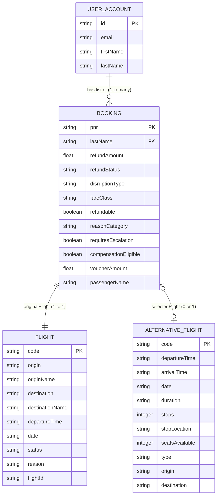
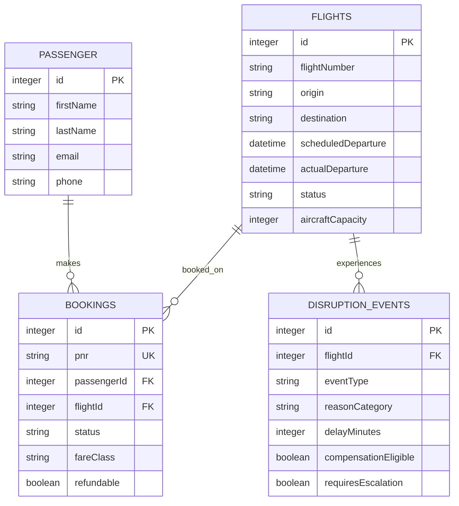

# Entity-Relationship (ER) Diagram

This document contains the Entity-Relationship (ER) diagram for the **Flight-Call-Bot** system. 

### Data Store State Note
As outlined in the [Solution Design Document](file:///d:/Projects/Flight-Call-Bot/docs/solution-design-document.md), there is no active physical database (SQLite/PostgreSQL) in the repository. Instead, the application's data models exist as in-memory TypeScript structures in `src/types.ts` and `src/mockData.ts`. This ER diagram reflects the **real objects and relationships** implemented in the client-side code, representing how passenger, booking, flight, and alternative flight information is structured and processed.

---

### Implemented Data Model (In-Memory React State)

The diagram below represents the exact structure defined in [types.ts](file:///d:/Projects/Flight-Call-Bot/src/types.ts) and [mockData.ts](file:///d:/Projects/Flight-Call-Bot/src/mockData.ts).

### Description of Implemented Entities

1. **USER_ACCOUNT (`UserAccount` in mockData.ts):** Represents an authenticated passenger profile. It maps to one or more `BOOKING` entities under the logged-in passenger's profile.
2. **BOOKING (`Booking` in types.ts):** The core record. Identified by a unique 6-character alphanumeric `pnr` (Passenger Name Record). It holds the disruption status, refund status (`Not Requested`, `Processing`, `Refunded`), and links to the disrupted flight details and any chosen rebooked alternative flight.
3. **FLIGHT (`Flight` in types.ts):** Represents the original flight that the passenger booked, including its route details and disruption status (`Cancelled`, `Delayed`, or `Confirmed`).
4. **ALTERNATIVE_FLIGHT (`AlternativeFlight` in types.ts):** Repesents the flight options available for rebooking. When a passenger selects a flight from the list of options, it is linked to the `BOOKING` as the `selectedFlight`.

---

### Conceptual Production Database Schema (Proposed)

In a production environment, the in-memory array structure would be normalized into a relational SQL database. The following is the conceptual schema mapped out in the development design logs:

